# GAN

* #### 등장 배경

  * 기존의 생성모델은 Markov-Chain이나 Variational Encoder와 같이 통계와 수학을 기반으로 하는 모델들인데, 발전을 거듭함에도 성능이 좋지 못했음

  * 2014년, Ian Goodfellow가 기존 방법론에서 벗어나, 두개의 Neural Network가 서로 경쟁하며 발전하는 방법을 제안함

    

* #### Adversarial Training

  * GAN을 이루는 두 네트워크인 Generator와 Descriminator는 주어진 입력 데이터를 두고 경쟁하며 학습함

    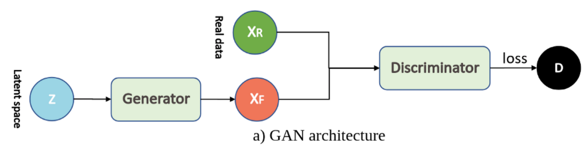

    

  * ##### Generator

    * Generator(생성자)는 Latent Space (일반적으로 Uniform Distribution, Gaussian Distribution)에서 random vector Z를 받아 Output Xf (fake)을 생성
    * 이때 Xf는 real data에서 sampling된 Xr (real)를 최대한 근사하도록 학습

  * ##### Discriminator

    * Discriminator(판별자)는 Xr을 True로, Xf를 False로 구분하도록 학습

      

    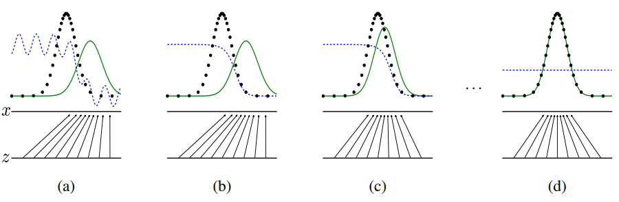

    * 학습이 진행되며 (b) 에서 D = Pdata(x) / (Pdata(x) + Pg(x))로 수렴
  * Generator가 학습을 거치며 Pg = Pdata로 수렴하게 되면 D가 두 분포를 구분하지 못하게 되어 D(x) = 0.5 에 수렴 (global optimum)
    
    * latent vector z도 실제 데이터와는 무관한 곳에 mapping되다가, G의 학습이 끝나면 real data distribution을 잘 표현할 수 있는 x로 mapping 

  

  

* #### Value Function

  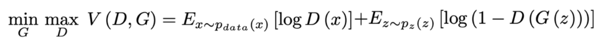

  * **Generator**는 log D(x)를 0으로, D(G(z))를 1로 만들어야 함. 즉, 판별자가 실제 데이터는 거짓으로, 가짜 데이터는 참으로 구분하게 만들어야 하기 때문에 우항 두 term이 모두 0이 되어야 하므로 위 식을 minimize하는 방향으로 학습

    * 그러나 학습 초기에는 G가 생성하는 이미지가 쉽게 구분되며 이는 gradient를 0에 가깝게 만들어 경사가 손실되는 문제가 생김. D가 고정되었다고 가정하고 G가 포함된 항을 최적화하여 문제 해결

      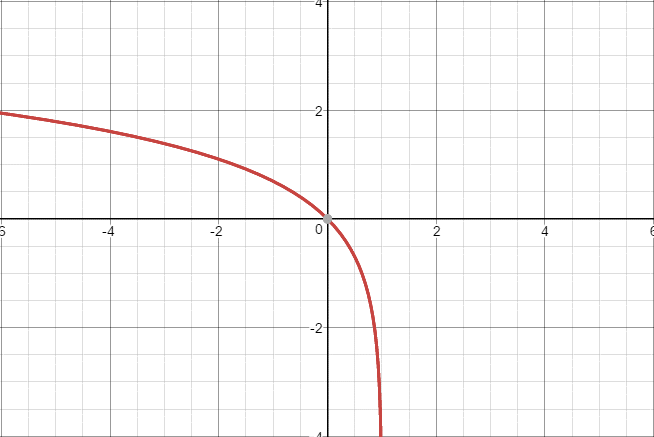

      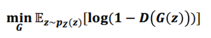

      

    * 위 식은 0에서 낮은 기울기를 가지기 때문에 이 학습이 잘 진행되지 않음. 따라서 다음과 같은 식으로 변형함

      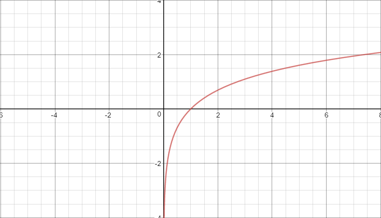

      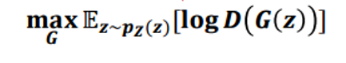

    * 변형된 식은 0에서 높은 급격한 기울기를 가지고 있기 때문에 학습이 빠르게 진행됨

      

  * **Discriminator**는 위와 반대로 log D(x)를 1로, D(G(z))를 0으로 만들어야 하기 때문에 위 식을 maximize 하는 방향으로 학습

    * D의 관점에서, G는 고정되었다고 가정하고 Z를 sampling하는 대신 x를 G에서 sampling

    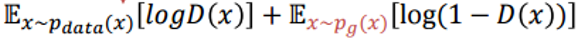

    

    * 기댓값의 정의에 따라 적분식으로 변환

      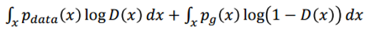

      

    * 이를 인테그랄로 묶으면 다음 식이 도출되며 이때 적분값이 최대가 되는 점, 즉 D(x)로 미분했을 때 0이 되는 지점을 찾아야 하며 이는 곧 극대값

      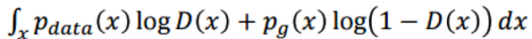

      

      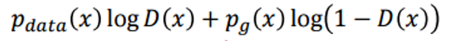

      

    * Pdata(x) = a, D(x) = y, Pg(x) = b 로 치환

      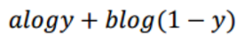

      

    * 이를 y에 대해 미분하면 다음과 같은 식이 나오고, 치환한 부호를 원래대로 바꾸면 극대, 최대값 도출

  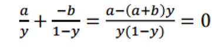

  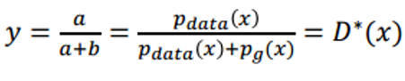

  

  * G를 최적화하는것은 JSD(Pdata||Pg)를 최소화시키는것과 같음. 따라서 Generator가 최적화되었을 때, 생성된 데이터의 분포는 실제 데이터의 분포와 동일하게 됨. 이는 GAN이 주어진 dataset의 distribution를 알아내는 작업이라는 것을 의미

    

* #### Experiment

  * MNIST, TFD, CIFAR-10을 대상으로 실험 진행

    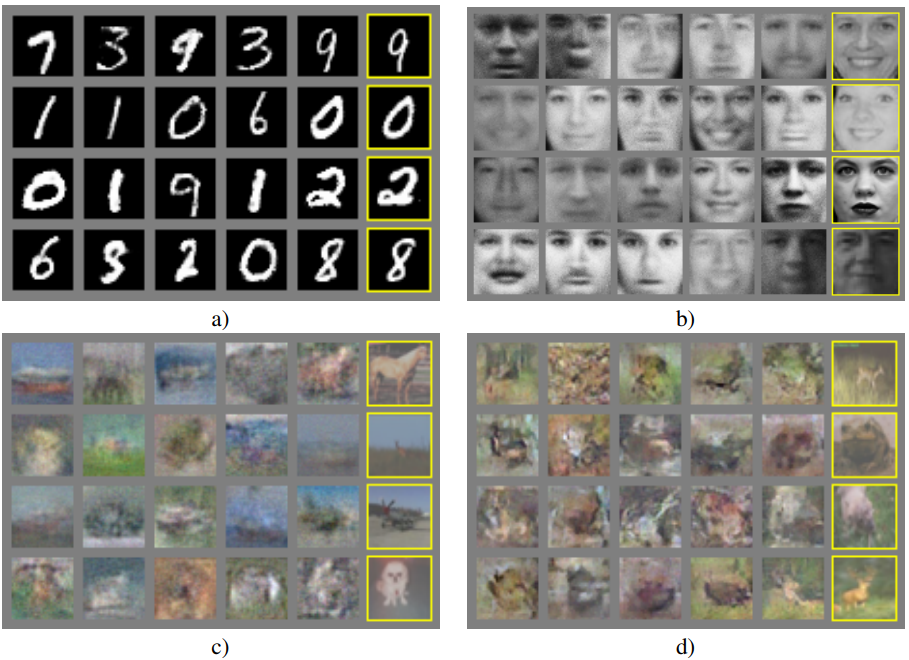

  * 실험 결과 실제 dataset과 유사한 데이터를 잘 생성함
  * 
  * 또한 G가 D를 잘 속이는 이미지를 발견했을 때, 계속 그 이미지만 생성하여 손실 함수가 작아지는 문제가 있음. Loss만을 줄일려고 학습하기 때문에 G가 한쪽으로 몰려 분포 다양성을 잃게 되는데 이를 모드 붕괴(Mode Collapse)라고 함
